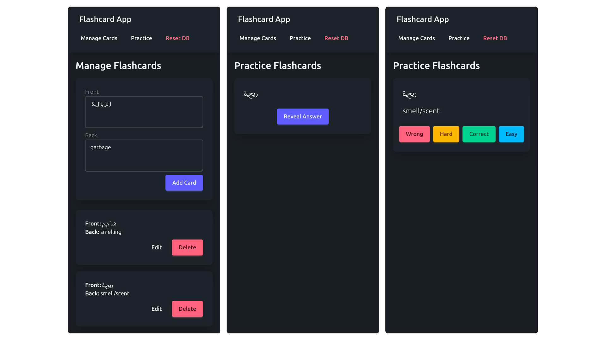

# Vue Learning App Template

- I regularly build little learning apps for various purposes, such as [learning geography](https://github.com/koljapluemer/learn-worldmap) or [learning languages](https://github.com/koljapluemer/video-vocab).
- This is an ongoing and evolving attempt to have a general-purpose boilerplate repo from which I can quickly prototype different learning apps
- It sets up a basic webapp, with utilities to create and edit flashcards, and to learn them with spaced repetition. This can be reconfigured into diverse learning apps.

## Features

- user can add, edit and delete flashcards
- user can practice flashcards in a standard spaced repetition flow (see front of card, think, reveal, judge how well you knew the card)
- user progress and cards are saved locally on their machine

## Using it

You are absolutely free to use this little app if it's useful to you. Here is some information that may be of use if you think that may be the case:

#### Tech Stack

- This is mainly a `Vue3` app. If you want to use this repo to your benefit, familiarize yourself with Vue, typescript, and specifically the `<setup script>` style of using Vue. If you have experience with frameworks such as `Angular` or `React`, you will have little trouble
- The template also uses `Tailwind`, `Daisy UI` and `Dexie` for local data storage.
- Learning stuff is handled with `ts-fsrs`, the best algo for spaced repetition out there.

#### Running it

1. Clone the repo or select `Use this template`. This process is the same for every such repo on GitHub, so if you're stuck with this step, consult a general guide of cloning and/or GitHub template repositories.
2. Make sure that you have `npm` installed
3. Go into the directory on your machine where you have this project and run `npm i`
4. Run `npm run dev` and click on the displayed URL to see the project in your browser
5. To start adapting the project, check out the `src/` directory, especially `views/`, `components/` and `composables/`. Most logic is here. 